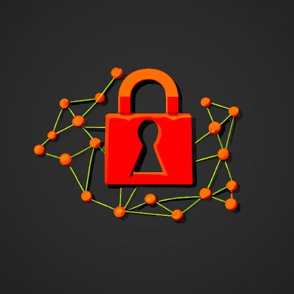

# MockupApp - CryptaCode

Statický [web](https://pslib-cz.github.io/2023-l4-web-mockupapp-VladislavLevitskii/),
Cvičení pro programátory

## Úkol
Vaším úkolem je implementovat JavaScriptové funkce pro šifrování a dešifrování textu pomocí různých šifer. Každá šifra by měla být implementována v samostatném JS souboru a měla by správně fungovat při použití na statickém webu.

## Jak začít

1. Stažení nebo naklonování repozitáře na vašem zařízení.
2. Otevřete statický web v prohlížeči a ověřte, že všechno funguje správně.
3. Upravte JavaScriptové soubory tak, aby implementovaly funkcionalitu pro šifrování a dešifrování textu.
4. Ověřte funkčnost každé šifry, zda se správně používají pomocí stránek níže.

## Funkce
Každá HTML stránka má svůj vlastní JavaScript, přičemž JS soubory předem obsahují proměnné, které budou použity při zpracování.

### Doporučení
Doporučuji používat Microsoft Copilot nebo ChatGPT4 pro ulehčení práce.

### Caesarova šifra
- Jednoduchá substituční šifra posunující každý znak v abecedě o pevný počet míst.
- Popis, jak funguje šifra je [tady](https://www.dcode.fr/caesar-cipher), také se dá na této stránce ověřit správnost šifry

### Vigenerova šifra
- Polyalphabetická substituční šifra, která používá klíč pro posunutí každého znaku v závislosti na jeho pozici.
- Informace a zkouška [zde](https://www.dcode.fr/vigenere-cipher)

### Hillova šifra
- Lineární šifra používající matici pro transformaci textu.
- Informace a zkouška [zde](https://www.dcode.fr/hill-cipher)

### Playfairova šifra
- Šifra využívající polygrafické substituce, která šifruje písmena v párech.
- Informace a zkouška [zde](https://www.dcode.fr/hill-cipher)

### Enigma
- Elektromechanický stroj používaný pro šifrování a dešifrování zpráv během druhé světové války.
- Informace [zde](https://en.wikipedia.org/wiki/Enigma_machine), [vyzkoušet](https://cryptii.com/pipes/enigma-machine)

### RSA
- Asymetrická šifra založená na problému faktorizace velkých čísel, používaná pro šifrování a digitální podpisy.
- Informace [zde](https://en.wikipedia.org/wiki/RSA_(cryptosystem)), [vyzkoušet](https://www.devglan.com/online-tools/rsa-encryption-decryption)
